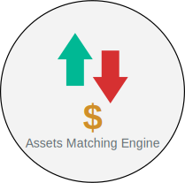

    

A matching engine is a technology that lies at the core of any exchange.

From a high-level perspective, a matching engine matches people (or organizations) who want to buy an asset with people who want to sell an asset.

### Problem Statement
This [file](Baraka%20Java%20Take%20Home%20Assignment%202025.pdf) includes all the information
needed to understand the problem this project is intended to solve.

### Design Overview
  

- The `MatchingEngine` is the central component—consists of a set of `OrderBook`s.
- Each `OrderBook` is responsible for a specific asset's booking information—via `2` Queues.
- One Queue is for `BUY` orders, another is for `SELL` orders.
- Queues are implemented with `PriorityBlockingQueue` as it's thread-safe and can prioritize elements based on a custom `Comparator`.
- Each order placed is assigned an id from an `AtomicLong` held by the `MatchingEngine`—Also a thread safe element used for counting.
- The `Archive` is a centralized registry that tracks all orders ever submitted to the system, and is managed by the matching engine.
- An `EventBus` is included to separate the logic of archiving from the typical booking process.
- All booking events are propagated from all `OrderBook`s to the `MatchingEngine`. 

### Built with
- Java (JDK 21).
- Spring Boot (3.4).

### Steps to deploy
- Load this project on Intellij.
- Run the application in `local` profile.
- Use [generated-requests.http](docs/generated-requests.http) to test the application.

  <h3 style="margin: 0; font-size: 1.5em;">📊 Code Coverage</h3>
  

  

