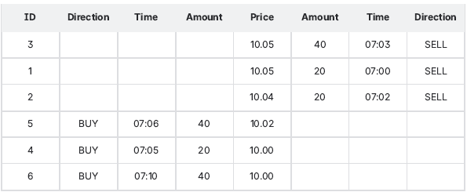
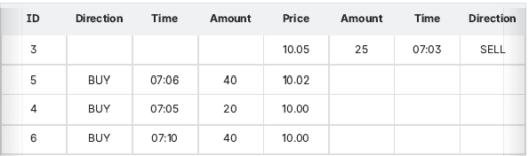

<div align="center">
    
</div>

## Overview

In this assignment, you will build a straightforward matching engine.  
A matching engine is a technology that lies at the core of any
exchange.  
From a high-level perspective, a matching engine matches people (or organizations) who want to buy an asset with people who
want to sell an asset.  
We want to support only one type of order for this exercise, namely limit order. A limit order is an order to buy an asset at no more
than a specific price or sell an asset at no less than a specific price.  
In real life, different algorithms can be used to match orders. Here we expect you to implement a continuous trading Price/Time
algorithm (aka FIFO).  
This algorithm ensures that all orders at the same price level are filled according to time priority; the first order at a price level is
the first order matched.  
For any new order, you prioritize the opposite order with the best price, and if you have multiple orders with the same price, the
earliest takes precedence.

Usually, the term order book is used to list all active buy and sell orders.

For example, consider such an order book:



If a new limit order buy `55` shares at `10.06` price comes in, then it will be filled in this order:
1. `20` shares at `10.04` (order 2)
2. `20` shares at `10.05` (order 1)
3. `15` shares at `10.05` (order 3)

This leaves the order book in the following state:



NB: order `3` is executed only partially.

## Requirements

- Implement the following HTTP API in `Java 21 `and `Spring Boot 3.4`.
- Don't implement any persistence. All state will be lost after restart. That's okay.
- Don't add support for different users.

### Place an order

**POST** `/orders`

- It is used to place a new limit order.
- It responds with the current state of the just created order.
- It means that the order can be already filled, but it can still be pending.
- Every order can be filled by one or many trades.
- Trade is a fact of finding matching counterparty order, order of the opposite direction with satisfying price and amount.

For example, taking our previous example, order buy 55 shares at 10. 06 price was filled by three trades:
1. `20` shares at `10.04` (order 2)
2. `20` shares at `10.05` (order 1)
3. `15` shares at `10.05` (order 3)

Endpoint must accept the JSON with the following fields:

```yml
asset: string, asset name, for simplicity this can be any text
price: number, a price for limit order
amount: number, amount of asset to fill by order
direction: string, can be either "BUY" or "SELL"
```
And respond with the JSON containing the following fields:

```yml
id: number, you need to generate a unique order ID
timestamp: string, date and time when the system registered order
price: number, the same as request body
amount: number, the same as request body
direction: string, the same as request body
pendingAmount: number, amount still to be filled
trades: an array of trade objects (see definition below), can be empty
```
Trade object:

```yml
orderId: number, counterparty order ID
amount: number, amount filled from counterparty order
price: number, price used for this trade
```

Request body example:
```json
{
  "asset": "TST",
  "price": 10.0,
  "amount": 100.0,
  "direction": "SELL"
}
```

Response body example:
```json
{
   "id": 2,
   "timestamp": "2021-12-08T10:22:00.460575730Z",
   "asset": "TST",
   "price": 10.0,
   "amount": 100.0,
   "direction": "SELL",
   "trades": [
      {
         "orderId": 0,
         "amount": 10.0,
         "price": 10.0
      }
   ],
   "pendingAmount": 90.0
}
```

### Get current order state

**GET** `/orders/{orderId}`

- Responds with the current state of the order with ID orderId (see previous endpoint response body).

Response body example:
```json
{
  "id": 2,
  "timestamp": " 2021 - 12 - 08 T 10 : 22 : 00. 460575730 Z",
  "asset": "TST",
  "price": 10.0,
  "amount": 100.0,
  "direction": "SELL",
  "trades": [
    {
      "orderId": 0,
      "amount": 10.0,
      "price": 10.0
    }
  ],
  "pendingAmount": 90.0
}
```

## Example

Imagine that we are going to use this system to emulate cryptocurrency exchange.  
For example, let's first place a limit order selling `1 Bitcoin` at the price no less than `43,251.00` euro.  
In order to do that we need to call the endpoint **POST** `/orders` with the following payload:
```
POST /orders
```
```json
{
  "asset": "BTC",
  "price": 43251.00,
  "amount": 1.0,
  "direction": "SELL"
}
```
Assuming that the Bitcoin order book is currently empty we will receive the following response:
```json
{
  "id": 0,
  "timestamp": "2021-12-08T13:34:44.498775730Z",
  "asset": "BTC",
  "price": 42251.00,
  "amount": 1.0,
  "direction": "SELL",
  "trades": [],
  "pendingAmount": 1.0
}
```

Now let's place some buy orders. Let's first start with an order to buy `0.25 Bitcoin` at the price of no more than `43,250.00`.

```
POST /orders
```
```json
{
  "asset": "BTC",
  "price": 43250.00,
  "amount": 0.25,
  "direction": "BUY"
}
```
Since we currently don't have a sell order with price satisfying this buy order, it just ends up in our order book.
```json
{
  "id": 1,
  "asset": "BTC",
  "price": 43250.0,
  "amount": 0.25,
  "direction": "BUY",
  "timestamp": "2025-05-29T10:31:12.4711639",
  "trades": [],
  "pendingAmount": 0.25
}
```
Now let's place an order to buy `0.35 Bitcoin` at the price of no more than `43,253.00`.
```
POST /orders
```
```json
{
  "asset": "BTC",
  "price": 43253.00,
  "amount": 0.35,
  "direction": "BUY"
}
```
In this case we have a matching order in our book, we can sell `0.35 Bitcoin` for `43,251.00`, which is lower than `43,253.00`.  
We get this on response:
```json
{
  "id": 2,
  "asset": "BTC",
  "price": 43253.0,
  "amount": 0.35,
  "direction": "BUY",
  "timestamp": "2025-05-29T10:54:56.0533737",
  "trades": [
    {
      "orderId": 0,
      "amount": 0.35,
      "price": 43251.0
    }
  ],
  "pendingAmount": 0.0
}
```
We can verify by getting current state of order `#0`:
```
GET /orders/0
```
```json
{
  "id": 0,
  "timestamp": "2021-12-08T13:34:44.460575730Z",
  "asset": "BTC",
  "price": 42251.00,
  "amount": 1.0,
  "direction": "SELL",
  "trades": [
    {
      "orderId": 2,
      "amount": 0.35,
      "price": 43251.00
    }
  ],
  "pendingAmount": 0.65
}
```
Current state of order `#2`:
```
GET /orders/2
```
```json
{
  "id": 2,
  "timestamp": "2021-12-08T13:34:50.460575730Z",
  "asset": "BTC",
  "price": 42253.00,
  "amount": 0.35,
  "direction": "BUY",
  "trades": [
    {
      "orderId": 0,
      "amount": 0.35,
      "price": 43251.00
    }
  ],
  "pendingAmount": 0.00
}
```
Let's place one last buy order to fully fill our initial sell order.
```
POST /orders
```
```json
{
  "asset": "BTC",
  "price": 43251.00,
  "amount": 0.65,
  "direction": "BUY"
}
```
We get this on response:
```json
{
  "id": 3,
  "asset": "BTC",
  "price": 43251.0,
  "amount": 0.65,
  "direction": "BUY",
  "timestamp": "2025-05-29T10:58:16.6364898",
  "trades": [
    {
      "orderId": 0,
      "amount": 0.65,
      "price": 43251.0
    }
  ],
  "pendingAmount": 0.0
}
```
Now both orders `#0` and `#3` are fully executed.
```
GET /orders/0
```
```json
{
  "id": 0,
  "asset": "BTC",
  "price": 43251.0,
  "amount": 1.0,
  "direction": "SELL",
  "timestamp": "2025-05-29T10:54:09.0994163",
  "trades": [
    {
      "orderId": 2,
      "amount": 0.35,
      "price": 43253.0
    },
    {
      "orderId": 3,
      "amount": 0.65,
      "price": 43251.0
    }
  ],
  "pendingAmount": 0.35
}
```
```
GET /orders/3
```
```json
{
  "id": 3,
  "asset": "BTC",
  "price": 43251.0,
  "amount": 0.65,
  "direction": "BUY",
  "timestamp": "2025-05-29T10:58:16.6364898",
  "trades": [
    {
      "orderId": 0,
      "amount": 0.65,
      "price": 43251.0
    }
  ],
  "pendingAmount": 0.0
}
```

<hr/>

## Design Overview
  

- The `MatchingEngine` is the central component—consists of a set of `OrderBook`s.
- Each `OrderBook` is responsible for a specific asset's booking information—via `2` Queues.
  - One Queue for `BUY` orders.
  - Another for `SELL` orders.
- Queues are implemented with `PriorityBlockingQueue` as it's thread-safe FIFO data structure that can prioritize elements based on a custom `Comparator`.
- Each order placed is assigned an id from an `AtomicLong`—Another thread safe element used in applications such as atomically incremented sequence numbers.
  - `AtomicLong` is also managed by the `MatchingEngine`.
- The `Archive` is a centralized registry that tracks all orders submitted to the system—Also managed by the `MatchingEngine`.
- An `EventBus` is included to separate the logic of archiving from the typical booking process.
- In other words, all booking events are propagated from `OrderBook`s to the `MatchingEngine` via the `EventBus`.

### Steps to deploy
- Load this project on Intellij.
- (Optional) Run the application in `local` profile to load testing data.
- Use [generated-requests.http](docs/generated-requests.http) to test the application.

<div align="center" style="margin: 20px 0; border: 2px solid; border-radius: 10px; background-color: transparent; max-width: 600px;">
  <h3 style="margin: 0; font-size: 1.5em;">📊 Code Coverage</h3>
  <div style="display: flex; flex-wrap: wrap; gap: 10px; justify-content: center;">


  </div>
</div>